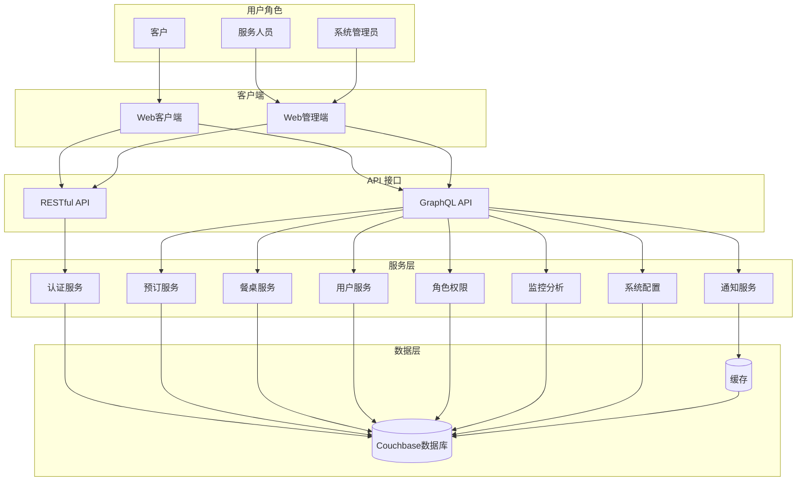
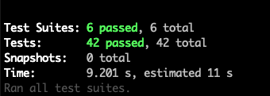
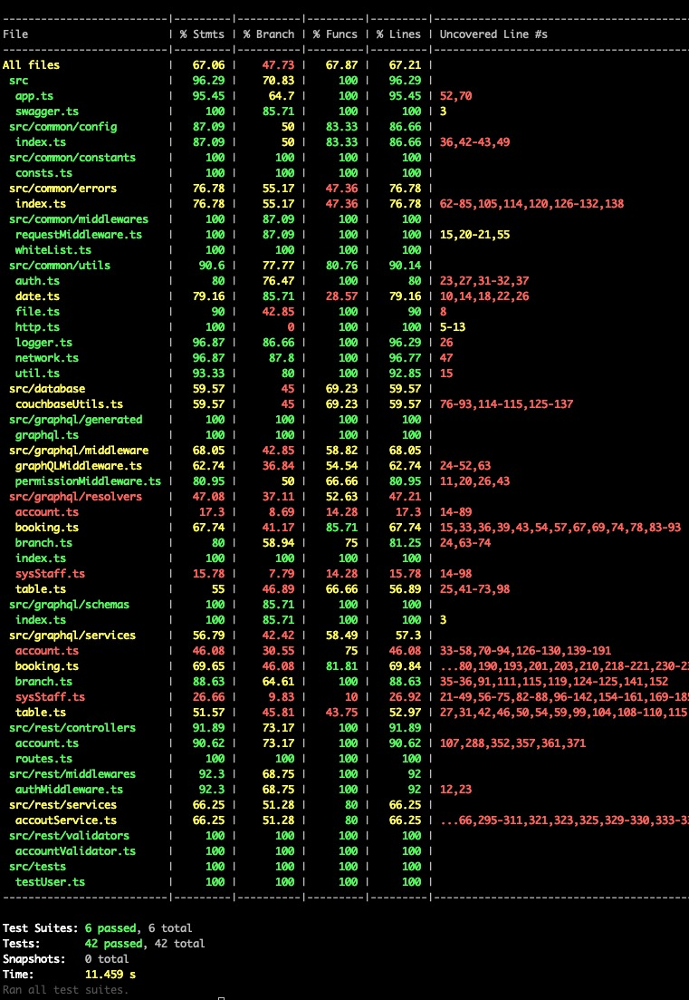

# 在线预订餐桌系统

## 1. 需求概述
### 1.1 核心功能需求
1. 客户功能
    - 账号注册/登录/登出
    - 餐桌查询与可用性检查
    - 预订创建/修改/取消
    - 个人预订历史查看
2. 服务人员功能
    - 管理端登录认证
    - 预订管理（查看/确认/修改）
    - 餐桌状态管理
    - 客户信息查看
3. 系统管理功能
    - 角色权限控制
    - 数据监控与分析
    - 系统配置管理

### 1.2 技术性需求
- 运行时：Node.js (使用Node.js 开发后端服务)
- 数据库：Couchbase（数据应持久化到NoSQL数据库）
- 双协议支持：同时提供 RESTful + GraphQL API （为身份验证服务构建RESTful端点；为业务服务构建GraphQL端点）
- 测试：Jest + Surptest（需要进行单元测试）
- 客户端：Solid（为客人和餐厅服务人员提供SPA）

## 2. 服务端
### 1.技术栈选型
- 运行时：Node.js + Typescript
- Web框架：Express.js
- GraphQL：Apollo server + GraphQL Code Generator
- 数据库：Couchbase
- 认证：JWT + bcrypt
- 验证：class-validator + class-transformer
- 测试：Jest + Surptest
- 部署：Docker

### 2.相关开发工具
- 代码生成（GraphQL Schema 类型生成）：GraphQL Code Generator
- API文档：Swagger（RESTful API） + GraphQL Playgroud
<!-- 暂未实现 -->
- 监控：Apollo Studio + Prometheus + Grafana
- CI/CD：Github Action + Docker Hub

### 3. 架构图


### 4. 项目结构

#### 4.1 项目结构
```
online-booking-server/
├── config
├── ├── env/                   # 项目不同环境下环境变量（如 数据库配置、密钥等）
├── src/
│   ├── common/                # 公共工具、常量、错误定义等
│   ├── database/              # 数据库工具（如 couchbaseUtils.ts）
│   ├── graphql/               # GraphQL 相关服务
│   │   ├── generated/         # GraphQL Code Generator生成的 GraphQL Schema类型等文件
│   │   ├── middleware/        # GraphQL 权限等中间件
│   │   ├── resolvers/         # GraphQL 业务解析器（如 bookingResolves、tableResolves 等）
│   │   ├── schemas/           # GraphQL schema 定义（如 booking.gql、table.gql 等）
│   │   ├── services/          # 业务服务层（如 booking.ts、table.ts、account.ts 等）
│   │   ├── types/             # 类型定义（如 booking.d.ts、table.d.ts 等）
│   ├── tests/                 # 单元测试用例（如 booking.test.ts、table.test.ts、branch.test.ts 等）
│   ├── app.ts                 # Express 应用入口
│   ├── index.ts               # Express 应用入口
│   ├── codegen.ts             # GraphQL Code Generator 配置文件
│   ├── swagger.ts             # Swagger 配置文件
│   └── ...                    # 其它辅助模块
│   ├── rest/                  # Restful 相关服务
│   │   ├── controllers/       # API 控制器
│   │   ├── middlewares/       # Restful 服务相关中间件
│   │   ├── services/          # Restful 服务业务逻辑封装
│   │   └── validators/        # 参数类型验证器
├── jwt-keys/                  # jwt 密钥信息
├── logs/                      # 服务运行日志
├── dist/                      # 编译后的产物（自动生成，勿手动修改）
├── package.json               # 项目依赖及脚本
├── tsconfig.json              # TypeScript 配置
├── jest.config.js             # Jest 测试配置
├── Dockerfile                 # Docker 部署配置
├── README.md                  # 项目说明文档
└── ...                        # 其它配置文件
```

#### 4.2 结构说明

- **src/common/**：存放通用工具、错误处理、常量等，供各模块复用。
- **src/database/**：数据库相关工具和连接管理，主要是 Couchbase 封装。
- **src/graphql/middleware/**：GraphQL 权限、认证等中间件。
- **src/graphql/resolvers/**：GraphQL 解析器，负责具体业务逻辑与服务层对接。
- **src/graphql/schemas/**：GraphQL schema 文件，定义 API 类型、输入输出结构。
- **src/graphql/services/**：业务服务层，封装具体业务操作（如预订、餐桌、账号等）。
- **src/graphql/types/**：TypeScript 类型定义，约束数据结构。
- **src/tests/**：Jest 单元测试用例，覆盖各业务模块。
- **dist/**：TypeScript 编译后的 JS 产物，实际部署运行用。
- **app.ts/server.ts**：应用和服务启动入口。
- **package.json/tsconfig.json/jest.config.js**：项目依赖、编译和测试配置。
- **Dockerfile**：容器化部署配置。
- **README.md**：项目说明和开发文档。

---

### 5. 运行

#### 注：本项目启动参数使用.env文件进行配置，配置方法如下
- 1. 在`online-booking-server/config/env`下找到`.env.example`文件
- 2. 将文件进行复制，开发环境下运行将其命名为`.env.development`; 同理测试环境下命名为`.env.test`; 生成环境命名为`.env.product`; 通过加载不同配置文件实现环境隔离
- 3. 复制到对应环境的文件，如需修改，各端需要配套进行修改，初步验证运行，开发环境内容可不做修改

### 6. 测试
#### 基于Jest + Surpertest 编辑测试用例
#### 测试结果如下（暂只对主要功能做了测试，部分测试数据需要进行初始化）：

测试结果



测试覆盖率



**该结构清晰分层，便于协作开发、测试和维**


## 3. 客户端（客户 + 餐厅服务人员）
### 采用monorepo架构，支持客户端预订和管理端操作

### …… 项目详情请查看相关项目README.md
